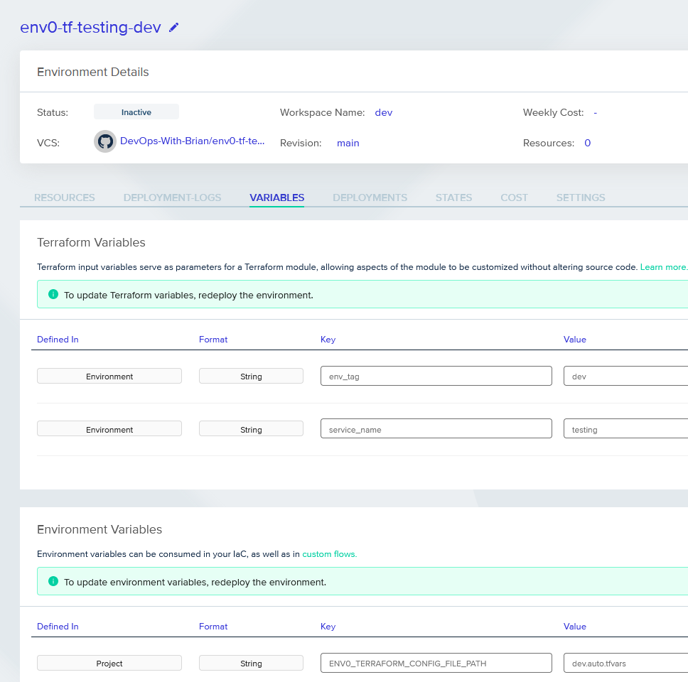

# env0-tf-testing
This repo is just a test going over env0 and using it with tfvars files.  In order to use them with env0 you simply need to supply a `ENV0_TERRAFORM_CONFIG_FILE_PATH` pointing to `dev.auto.tfvars` or `prod.auto.tfvars` for example.  So far in testing I created 2 environments inside the env0 project one for dev and one for prod pointing to each of these.

